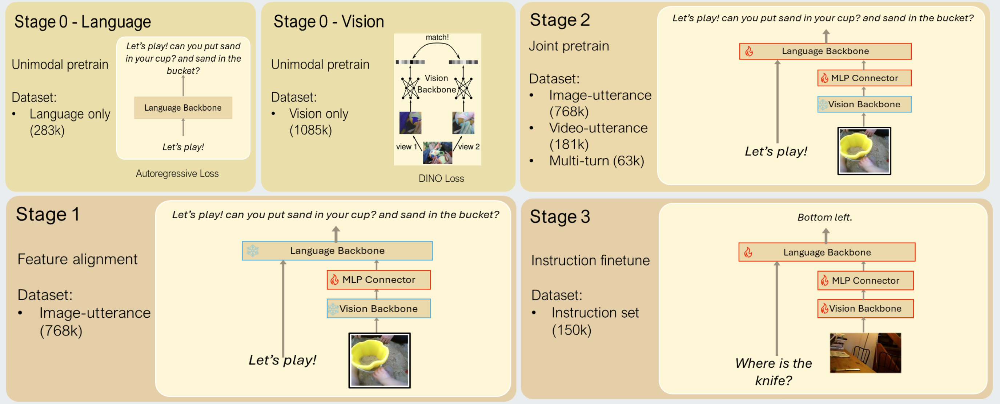

# BabyLLaVA-V2: Generative VLM Trained-from-scratch on SAYCam

📄 [Paper](https://arxiv.org/abs/2512.10932) | 🌐 [Project Page](https://shawnking98.github.io/BabyVLM-v2/) 

<a href="https://shawnking98.github.io/">Shengao Wang</a><sup>*†1</sup>,
<a href="https://wqwang.me/">Wenqi Wang</a><sup>*1</sup>,
<a href="https://victor-wang-902.github.io/">Zecheng Wang</a><sup>*1</sup>,
<a href="https://www.linkedin.com/in/max-whitton-9b648a222/">Max Whitton</a><sup>*1</sup>,
<br>
<a href="https://www.linkedin.com/in/mikewakeham/">Michael Wakeham</a><sup>1</sup>,
<a href="https://arjunchandra2.github.io/">Arjun Chandra</a><sup>1</sup>,
<a href="https://www.linkedin.com/in/joey-t-huang/">Joey Huang</a><sup>1</sup>,
<a href="https://www.linkedin.com/in/pengyuez/">Pengyue Zhu</a><sup>1</sup>,
<br>
Helen Chen<sup>‡1</sup>,
David Li<sup>‡1</sup>,
Jeffrey Li<sup>‡1</sup>,
Shawn Li<sup>‡1</sup>,
Andrew Zagula<sup>‡1</sup>,
Amy Zhao<sup>‡1</sup>,
Andrew Zhu<sup>‡1</sup>,
<br>
Sayaka Nakamura<sup>2</sup>,
Yuki Yamamoto<sup>2</sup>,
Jerry Jun Yokono<sup>2</sup>,
<br>
<a href="https://aaronmueller.github.io/">Aaron Mueller</a><sup>1</sup>,
<a href="https://bryanplummer.com/">Bryan A. Plummer</a><sup>1</sup>,
<a href="https://ai.bu.edu/ksaenko.html">Kate Saenko</a><sup>1</sup>,
<a href="https://venkatesh-saligrama.github.io/">Venkatesh Saligrama</a><sup>1</sup>,
<a href="https://boqinggong.github.io/">Boqing Gong</a><sup>1</sup>


<span class="author-block"><sup>1</sup>Boston University,</span>
<span class="author-block"><sup>2</sup>Sony Group Corporation</span>

<div class="is-size-7 publication-authors">
<span><sup>*</sup>Equal contribution. <sup>†</sup>Project lead. <sup>‡</sup>Equal contribution; work done as interns at Boston University.</span>
</div>

## Overview

This is the codebase of the "Baby model" introduced in BabyVLM-V2, adapted from the original [LLaVA repository](https://github.com/haotian-liu/LLaVA). In this repo, we'll refer to the model as BabyLLaVA-V2.

## Environment Setup

Install this package by cloning the repository and running the following command:

```bash
git clone git@github.com:ShawnKing98/BabyLLaVA-V2.git
cd BabyLLaVA-V2
pip install -e ".[train]"
pip install flash-attn==2.6.3 --no-build-isolation
```

## Data Preparation

The training data uses post-processed data from the SAYCam dataset, which is hosted on the [Databrary](https://nyu.databrary.org/volume/564) platform. According to SAYCam's regulation terms, we cannot publicly share the dataset here. We are currently working towards putting our dataset on Databrary as well, please stay tuned for future updates.

### Instruction Finetuning Data Sample: Ego4D Variant

Due to the limited availability of the SAYCam dataset, we additionally release a publicly shareable instruction finetuning [sample](https://huggingface.co/datasets/wsashawn/babyllava_v2_instruction_ft_Ego4D) built on [Ego4D](https://ego4d-data.org/). It covers five tasks: counting, left/right relations, spatial details, synthetic comparison, and subitizing. The sample can be used as a drop-in reference for the format expected by phase 3 training.

From the repository root, download it into `playground/data/Ego4D_instruction_ft` so that the relative image paths inside the annotation files resolve correctly:

```bash
hf download wsashawn/babyllava_v2_instruction_ft_Ego4D \
    --repo-type dataset \
    --local-dir playground/data/Ego4D_instruction_ft
```

The resulting folder looks like:

```
playground/data/Ego4D_instruction_ft
├── count_train.json              # 14,775 samples
├── leftright_train.json          # 14,775 samples
├── spatialdetails_train.json     # 29,757 samples
├── compare_synthetic_train.json  # 14,775 samples
├── subitize_train.json           # 14,775 samples
└── images/
    ├── count/
    ├── leftright/
    ├── spatialdetails/
    ├── compare_synthetic/
    └── subitize/
```

Each entry follows the standard LLaVA conversation format, with `image` given as a list of paths relative to the dataset root. Multi-image tasks retain an additional source subdirectory where necessary to distinguish different images that have the same original filename.

```json
{
  "id": "count_0",
  "image": ["images/count/d08f05ff-d72b-410c-9081-2d5fc2eaaa52_1260_bottle_7.jpeg"],
  "conversations": [
    {"from": "human", "value": "How many bottle do you see?"},
    {"from": "gpt", "value": "7"}
  ]
}
```

## Download Checkpoints

The checkpoints of our 1.1B BabyLLaVA-V2 model can be downloaded from Hugging Face. We provide several checkpoints after different phase of training, see below:

| Phase | Checkpoint |
|-------|------------|
| Vision Pretrain (phase 0 - vision) | [Link](https://huggingface.co/wsashawn/babyllava_v2_vision_backbone) |
| Joint Pretrain (phase 2) | [Link](https://huggingface.co/wsashawn/babyllava_v2_phase2) |
| Instruction Finetuning (phase 3) | [Link](https://huggingface.co/wsashawn/babyllava_v2_instruction_ft) |

## Usage
Please refer to the original [LLaVA repository](https://github.com/haotian-liu/LLaVA) for the usage of the BabyLLaVA model, most of the APIs should be the same.

## Training
Please see the figure below for an overview of the whole training pipeline. More details can be found in appendix A of the paper.



### Phase 0 - Language:
Run the following command to train a compact language model (TinyLLaMA-1.1B) from scratch on the transcribed SAYCam. Please note that you need to change the data path in the script to point to your local SAYCam transcription data.

```bash
bash scripts/babyLLaVA_train/sweep_phase0.sh
```

### Phase 0 - Vision:

The vision backbone is trained from scratch separately, using Orhan et al.'s [training pipeline](https://github.com/eminorhan/dino). Please check [their paper](https://arxiv.org/abs/2305.15372) for more details about the vision backbone. 


### Phase 1:
Run the following command for phase 1 training. You need to change the data path / language backbone checkpoint / vision backbone checkpoint in the script to point to your local files.
```bash
bash scripts/babyLLaVA_train/sweep_phase1.sh
```

### Phase 2:
Run the following command for phase 2 training. In addition to the modification needed for phase 1, you also need to update the MLP connector to point to the checkpoint of phase 1 training.
```bash
bash scripts/babyLLaVA_train/sweep_phase2.sh
```

### Phase 3:

Run the following command for phase 3 training (instruction finetuning). This script kicks off instruction finetuning for several different tasks sequentially, you can modify the tasks being tuned by editing the corresponding fields.

```bash
bash scripts/babyLLaVA_train/sweep_instruction_ft.sh
```

#### Phase 3 on the Ego4D Sample

For phase 3 training with the publicly available Ego4D sample:

1. From the repository root, download the dataset into `playground/data/Ego4D_instruction_ft` using the command in [Ego4D Instruction Finetuning Sample](#instruction-finetuning-data-sample-ego4d-variant). Confirm that the five `*_train.json` files and the five task directories under `images/` are present.
2. Download the [phase 2 checkpoint](https://huggingface.co/wsashawn/babyllava_v2_phase2) and the [vision backbone checkpoint](https://huggingface.co/wsashawn/babyllava_v2_vision_backbone).
3. Edit `scripts/babyLLaVA_train/sweep_instruction_ft_ego4d.sh` and replace the placeholders:
  - `backbones` with your local phase 2 checkpoint folder.
  - `--vision_tower` with your local vision backbone checkpoint (`.pth`).
  - `EGO4D_DATA_ROOT` only if you downloaded the dataset somewhere else.
4. Launch the five sequential instruction-tuning runs:

```bash
bash scripts/babyLLaVA_train/sweep_instruction_ft_ego4d.sh
```

The script aligns `datasets`, `run_names`, and `image_folders` by task. Each `--image_folder` points to the dataset root, so the relative `images/...` paths inside every training JSON resolve automatically. Checkpoints are written to `./checkpoints_instruction_ft_ego4d`.

## Citation

Please cite us if you use this repository in your work.

```bibtex
@misc{wang2026babyvlmv2developmentallygroundedpretraining,
      title={BabyVLM-V2: Toward Developmentally Grounded Pretraining and Benchmarking of Vision Foundation Models}, 
      author={Shengao Wang and Wenqi Wang and Zecheng Wang and Max Whitton and Michael Wakeham and Arjun Chandra and Joey Huang and Pengyue Zhu and Helen Chen and David Li and Jeffrey Li and Shawn Li and Andrew Zagula and Amy Zhao and Andrew Zhu and Sayaka Nakamura and Yuki Yamamoto and Jerry Jun Yokono and Aaron Mueller and Bryan A. Plummer and Kate Saenko and Venkatesh Saligrama and Boqing Gong},
      year={2026},
      eprint={2512.10932},
      archivePrefix={arXiv},
      primaryClass={cs.CV},
      url={https://arxiv.org/abs/2512.10932}, 
}
```